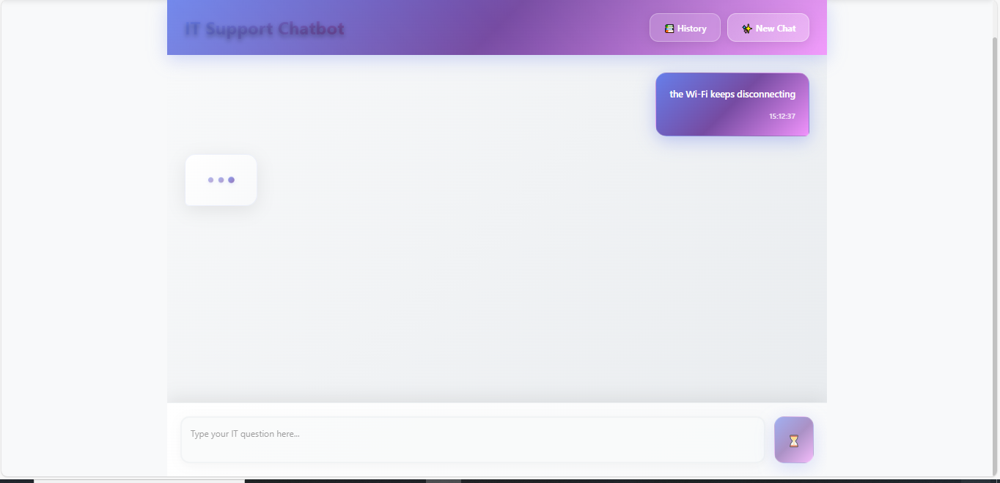

# BotIT 🚀
Unified Platform for IT Health Analytics & Intelligent Support Chatbot

##📖 Project Overview
BotIT is a comprehensive full-stack application developed during my final-year internship at Lear Corporation Tangier. This unified platform combines IT infrastructure health analytics with an intelligent support chatbot to enhance IT service management in industrial environments. The system transforms raw performance and security data into actionable insights while providing real-time troubleshooting assistance through conversational AI.

---

🎯 Objectives
- Develop a dual-functionality platform for IT infrastructure monitoring and user support

- Transform raw IT data into actionable insights through automated analysis and visualization

- Provide intelligent, context-aware troubleshooting assistance via AI-powered chatbot

- Reduce IT support resolution time and improve operational efficiency

- Enable proactive risk detection and infrastructure optimization

# 🧠 System Architecture
## Frontend (React.js + Vite)

- Framework: React.js with modern hooks and functional components

- Routing: React Router for seamless navigation

- Styling: Custom CSS with responsive design

- Components:

Analysis Upload Page (CSV processing and visualization)

Chatbot Interface (Real-time IT support)

Navigation Bar with active link highlighting

## Backend (FastAPI - Python)
- Framework: FastAPI for high-performance REST APIs

- Modules:

analysis_app: Data cleaning, KPI generation, and visualization

chatbot_app: Intelligent support with RAG architecture

- API Endpoints:

/analysis - Data processing and insights

/chat - Chatbot interactions with session management

/health - System monitoring

---

# ⚙️ Core Functionalities
## 1.Data Analysis & Dashboard Module

### Data Processing Pipeline:

- Data Sources: Hybrid approach combining real security data (CVE, KB patches) with synthetic performance metrics

- Data Cleaning: Configurable pipeline with duplicate removal, missing value handling, and standardization

- Criticality Scoring: Weighted risk assessment based on performance, security, and connectivity metrics

- KPI Generation: Fleet-wide insights including risk distribution, security exposure, and resource utilization

### Visualization Features:

- Severity Distribution Pie Charts

- Critical Score Histograms

- Problem Frequency Bar Charts

- Resource Usage Box Plots

- Vulnerability Overview Charts
---

## 2.Intelligent Support Chatbot
### RAG Architecture (Retrieval-Augmented Generation):
#### Knowledge Base:
- Manually curated IT troubleshooting content from reliable sources

- Problem → Solution format with step-by-step procedures

- Structured CSV format with 384-dimensional embeddings

#### Technical Stack:

- Embeddings: all-MiniLM-L6-v2 sentence transformer model

- Vector Search: FAISS (Facebook AI Similarity Search) for efficient semantic retrieval

- LLM: GPT-4o-mini for natural language generation and reasoning

- Session Management: Context tracking for multi-turn conversations
#### Workflow:

1. User query embedding and semantic similarity search

2. Top-3 candidate retrieval with cosine similarity scoring

3. Confidence threshold decision (default: 0.5)

4. Response generation with KB context or fallback to general GPT

5. Session context maintenance for follow-up queries

---

# 📊 Key Features
## For IT Administrators:

- Automated Data Analysis: Transform raw CSV data into actionable insights

- Critical Machine Identification: Risk scoring and prioritization

- Interactive Dashboards: Real-time visualization of infrastructure health

- Security Exposure Analysis: CVE tracking and patch management insights
## For End Users:
- 24/7 IT Support: Instant troubleshooting assistance

- Context-Aware Responses: Session memory for complex issues

- Step-by-Step Guidance: Clear, actionable solutions

- Natural Language Interface: No technical expertise required

---

# 🛠️ Technologies Used
## Backend
- FastAPI - Modern Python web framework

- Sentence-Transformers - Semantic embeddings

- FAISS - Vector similarity search

- OpenAI GPT-4o-mini - Language model

- Pandas - Data manipulation

- Matplotlib/Seaborn - Visualization generation

## Frontend
- React.js - User interface framework

- Vite - Build tool and dev server

- CSS3 - Styling and responsive design

- Base64 - Image encoding for charts

## Deployment & Tools
- REST APIs - Communication protocol

- CORS - Cross-origin resource sharing

- JSON - Data interchange format

---

## 📊 Demonstration
- **Dashboard :** Upload de CSV, visualisation des anomalies, KPIs.
- **Chatbot :** Dialogue en langage naturel avec support RAG.

---

# 🔮 Future Enhancements
## Technical Improvements
- Real-time Data Integration: Live endpoint telemetry from SIEM tools

- ML Anomaly Detection: Advanced pattern recognition beyond threshold-based scoring

- Multilingual Support: Expand chatbot capabilities to multiple languages

- Voice Interaction: Natural conversation interfaces

## Feature Expansion
- Automated Knowledge Base Updates: Pipeline for continuous KB enrichment

- Mobile Applications: Cross-platform accessibility

- Enterprise Integration: Connectors for popular IT management tools

- Predictive Analytics: Failure prediction and proactive maintenance

---

# 👥 Contributors
**Developer**: EL ALAMI Nihad
**Company Supervisors**: Mr. Mohamed Ali BNABDELJALIL, Mr. Rida GHAAMER

**Institution**: École Nationale des Sciences Appliquées de Tétouan
**Major**: Big Data and Artificial Intelligence
**Academic Year**: 2024 – 2025
**Host Organization**: Lear Corporation Tangier

---

# 📜 License
This project was developed as part of academic coursework and internship at Lear Corporation. Please contact the authors for usage permissions.

---

# 🙏 Acknowledgments
Lear Corporation Tangier for providing the industrial context and supervision

ENSA Tétouan for academic guidance and support

The open-source community for FAISS and Sentence-Transformers libraries

